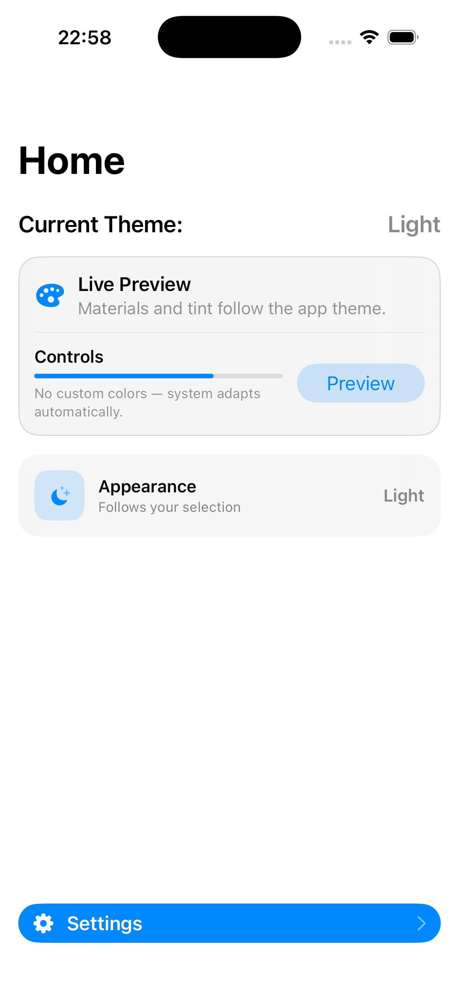
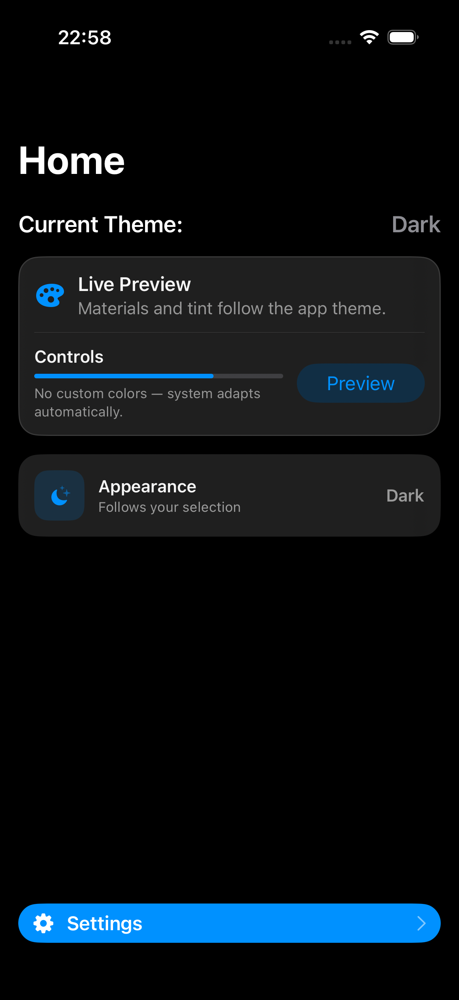
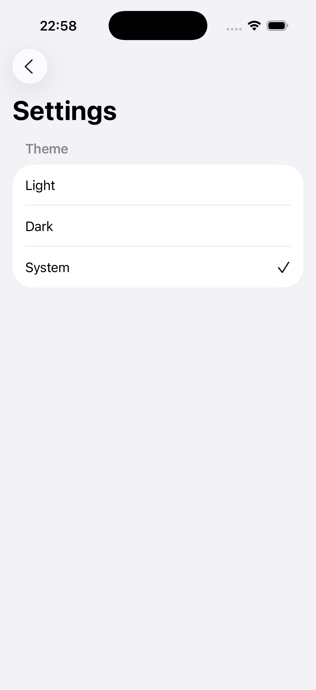

# Theme Demo (SwiftUI)

A simple iOS demo app that demonstrates **app-wide theme management** using **SwiftUI**, **MVVM**, and **UserDefaults persistence**.

Users can switch between **System**, **Light**, and **Dark** appearance modes. The selected theme is saved and automatically applied across the app.

---

## Features

- System / Light / Dark theme selection
- App-wide appearance handling via `preferredColorScheme`
- Persistent theme storage with `UserDefaults`
- Clean MVVM architecture
- Live preview on the Home screen
- Fully system-driven colors and materials (no custom color overrides)

---

## Architecture

The project follows a clean **MVVM-based folder structure** aligned with SwiftUI best practices:

```
ThemeDemo
 └─ ThemeDemo
    ├─ AppEntry
    │  └─ AppEntry.swift
    ├─ Models
    │  └─ ThemeModel.swift
    ├─ Storage
    │  └─ ThemeStore.swift
    ├─ ViewModels
    │  └─ SettingsViewModel.swift
    ├─ Views
    │  ├─ HomeView.swift
    │  └─ SettingsView.swift
    └─ Resources
       └─ Assets.xcassets
```

### Layer Responsibilities

- **AppEntry**: Application entry point and root configuration
- **Models**: Domain models (e.g. theme representation)
- **Storage**: Persistence layer (`UserDefaults` abstraction)
- **ViewModels**: Business logic and state management
- **Views**: SwiftUI views (UI only)
- **Resources**: Assets and app resources

This structure ensures clear separation of concerns, maintainability, and scalability.

---

## Theme Management

### Theme Model

Themes are represented using a type-safe enum:

```swift
enum ThemeModel: String, CaseIterable {
    case system
    case light
    case dark
}
```

### Applying the Theme

The selected theme is applied at the **app root** using:

```swift
.preferredColorScheme(...)
```

| Selected Theme | Applied Value |
| --- | --- |
| System | `nil` (follows device settings) |
| Light | `.light` |
| Dark | `.dark` |

When **System** is selected, the app automatically adapts to device appearance changes.

---

## Home Screen Preview

The Home screen includes a lightweight preview area that visually reflects the current theme:

- System materials (`.thinMaterial`, `.regularMaterial`)
- Accent color behavior
- Buttons, progress views, and cards adapting instantly

When **System** is selected, the UI displays the active appearance:

```
System (Light)
System (Dark)
```

This makes theme behavior clear without adding visual clutter.

---

## UserDefaults Persistence

Theme persistence is handled via a dedicated storage layer:

```swift
protocol ThemeStoring {
    func loadTheme() -> ThemeModel
    func saveTheme(_ theme: ThemeModel)
}
```

The `ThemeStore` implementation:

- Centralizes all `UserDefaults` access
- Provides safe fallback values
- Keeps ViewModels free from storage details

---

## Navigation

- Uses `NavigationStack`
- Navigation is defined at the app root level
- Avoids nested navigation to prevent animation issues
- Compatible with system appearance changes

---

## Design Principles

- No hardcoded colors
- Uses system colors and materials only
- Respects system Light/Dark behavior
- Minimal UI with clear feedback
- Optimized for clarity and maintainability

---

## Screenshots

<p align="center">
  
  
  
</p>

---

## Demo Video

https://github.com/USERNAME/ThemeDemo/assets/XXXXXXXX/theme-demo.mp4

---

## Requirements

- iOS 17+
- SwiftUI
- Xcode 15+

---

## License

This project is intended for learning and portfolio demonstration purposes.

